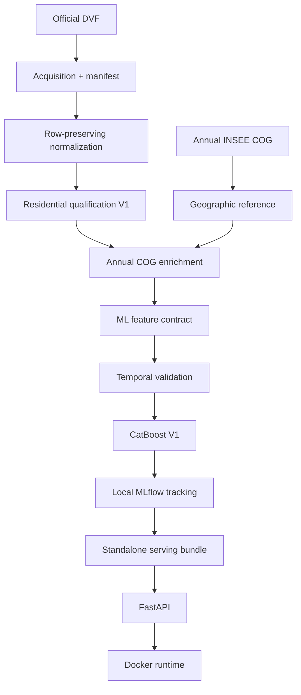

# Real Estate Price Prediction — Data Engineering, Machine Learning & MLOps

A reproducible pipeline for French real-estate transactions, annual geographic
resolution, strict temporal validation, CatBoost modelling, MLflow tracking,
FastAPI serving, Docker packaging, and continuous integration.

## Overview

This project estimates residential transaction prices per square metre from
official French property and geographic data. It covers the complete path from
source acquisition to a standalone inference service while keeping data
provenance, temporal separation, and target leakage explicit.

The repository implements:

- reproducible acquisition and local byte-level provenance for DVF and COG;
- row-preserving DVF normalization with bounded memory;
- deterministic qualification of simple residential mutations;
- annual geographic resolution against the matching COG vintage;
- a strict feature allowlist and temporal ML protocol;
- a frozen CatBoost V1 model tracked locally with MLflow;
- a FastAPI service backed by a validated standalone model bundle;
- a non-root Docker runtime and GitHub Actions quality gates.

## Verified data scope

| Stage | Verified volume |
| --- | ---: |
| Normalized DVF source rows, 2021–2025 | 20,382,915 |
| Contiguous synthetic mutation groups | 7,319,609 |
| Qualified residential transactions | 3,160,518 |
| Transactions resolved against annual COG | 3,158,832 |
| Unresolved geographic codes retained | 1,686 |
| Geographic coverage | 99.946654314261% |

## Architecture



The stages remain separate by design: acquisition identifies source bytes,
normalization preserves source rows, qualification applies the business
contract, geography enriches accepted mutations, and ML consumes an explicit
allowlist.

## Official data sources and provenance

### DVF transactions

[Demandes de valeurs foncières (DVF)](https://www.data.gouv.fr/datasets/demandes-de-valeurs-foncieres)
are produced by the French Directorate General of Public Finances (DGFiP) and
published through data.gouv.fr. This project uses the 2021–2025 vintages.

Acquisition streams each configured archive to an atomic temporary file and
validates its size and ZIP structure. A local manifest records the configured
source URL, final redirected URL, filename, byte count, download timestamp, and
locally computed SHA-256. Resource URLs are not treated as immutable snapshots;
the manifest identifies the exact bytes used locally. Raw data and manifests are
excluded from Git.

### Annual COG geography

The [Code officiel géographique (COG)](https://www.insee.fr/fr/information/2560452)
is published by INSEE. The pipeline uses one annual COG reference for each DVF
vintage from 2021 through 2025. It resolves source codes with the audited
priority `COM → ARM → COMD → COMA`; `COMPARENT` links an arrondissement,
delegated commune, or associated commune to its canonical `COM` entry.

Geographic joins use administrative codes only. Commune labels are never used
as join keys, and historical commune files never remap transactions
automatically. See the [geographic contract](docs/geography_contract.md).

The Base permanente des équipements (BPE) was audited but excluded from V1
because its availability and reference geography do not support a sufficiently
consistent same-vintage feature across the full study period. In particular,
INSEE did not publish a BPE 2022 vintage. No BPE feature enters the model.

## Data pipeline

1. **DVF acquisition** downloads only explicitly configured 2021–2025 archives
   and records their local provenance.
2. **Normalization** reads directly from ZIP archives in batches and emits one
   normalized row for every source row.
3. **Qualification** groups contiguous normalized rows and retains only simple,
   admissible residential mutations.
4. **COG acquisition** applies the same manifest, checksum, retry, and atomic
   publication principles to annual INSEE archives.
5. **Geographic reference construction** resolves each current COG source code
   according to `COM → ARM → COMD → COMA`.
6. **DVF–COG enrichment** performs a left join against the COG of the same year;
   every qualified DVF transaction remains present exactly once.
7. **ML dataset construction** selects only the frozen V1 features and derives
   the transformed target and temporal indicators.

The detailed data commands and invariants are documented under
[Documentation](#documentation).

## Qualification contract

V1 keeps one observation per simple residential mutation that satisfies the
validated rules for sale nature, disposition, parcel, residential local count,
local type, transaction amount, and positive built surface. Dependencies are
allowed; commercial or industrial locals are excluded. The complete ordering of
checks and rejection reasons is defined in
[DVF qualification V1](docs/dvf_qualification.md).

The target source is calculated only after admission:

```text
prix_m2 = valeur_fonciere / surface_reelle_bati
```

Because `valeur_fonciere` algebraically determines `prix_m2` together with a
model feature, it is explicitly forbidden as an ML feature. The feature dataset
is built from an allowlist rather than by dropping a blacklist.

## Machine-learning protocol

The evaluation is temporal; the project does not use a random split.

| Phase | Years | Rows | Purpose |
| --- | --- | ---: | --- |
| Model selection train | 2021–2023 | 2,048,075 | Fit candidate model and baselines |
| Model selection validation | 2024 | 521,169 | Select and freeze V1 |
| Final model fit | 2021–2024 | 2,569,244 | Fit the frozen configuration |
| Final one-shot test | 2025 | 591,274 | Final evaluation only |

The source target is `prix_m2`; training uses
`log_prix_m2 = ln(prix_m2)`. V1 applies no clipping, winsorization, or outlier
filtering. Predictions are transformed back with `exp` for metrics and serving.

The selected model is `CatBoostRegressor` with native categorical handling and
the following frozen parameters:

| Parameter | Value |
| --- | ---: |
| `iterations` | 3000 |
| `learning_rate` | 0.05 |
| `depth` | 8 |
| `random_seed` | 42 |

Hyperparameter exploration was deliberately limited. After selection on 2024,
the features, target, outlier treatment, model architecture, and parameters were
frozen. The final fit uses exactly 3,000 iterations without an evaluation set or
early stopping.

### Frozen feature contract

The model receives exactly 16 ordered features:

| Group | Features |
| --- | --- |
| Numeric | `surface_reelle_bati`, `nombre_pieces_principales`, `nombre_lots`, `surface_terrain` |
| Boolean | `has_dependance` |
| Categorical | `code_type_local`, `code_postal`, `code_departement`, `source_code_commune`, `canonical_commune_code`, `resolved_geo_type`, `region_code` |
| Derived | `mutation_year`, `mutation_month`, `surface_terrain_missing`, `geography_unresolved` |

Missing categorical values use the stable `__MISSING__` category. A missing
terrain surface remains distinct from a measured zero, and unresolved
geographies remain in the dataset.

## Results

### Model selection — validation 2024

| Model | RMSE log | MAE €/m² | Median AE €/m² |
| --- | ---: | ---: | ---: |
| `DEPARTMENT_TYPE_MEDIAN` baseline | 0.6590399945589221 | 1147.7414970737116 | 754.010441767065 |
| CatBoost V1 | 0.5454508466588915 | 829.2568229919669 | 494.46181031372157 |

### Final one-shot test — 2025

| Slice | Rows | RMSE log | MAE €/m² | Median AE €/m² |
| --- | ---: | ---: | ---: | ---: |
| Global | 591,274 | 0.5142518638253868 | 841.7623633027805 | 497.8948115618889 |
| Houses | 249,574 | 0.5162246411847635 | 657.7340904677158 | 436.505573319492 |
| Apartments | 341,700 | 0.5128061726001529 | 976.1746318557172 | 556.1008610844178 |

The 2025 holdout was opened once, after the model had been frozen and fitted on
2021–2024. Its results were not used for further optimization. The MLflow run is
tagged when test evaluation starts and again when it completes; any started or
completed evaluation blocks another attempt.

These aggregate errors describe performance on the holdout population. They are
not guarantees for an individual property or transaction. The versioned records
are [model_selection.json](reports/model_selection.json) and
[final_test_2025.json](reports/final_test_2025.json).

## MLflow and reproducibility

MLflow uses a project-local SQLite tracking store and local artifact directory.
The final run records the model version, frozen parameters, data-year protocol,
software versions, training Git commit, ordered feature names, categorical
features, and the SHA-256 of the feature contract. Logged artifacts include the
CatBoost model, feature contract, ML configuration, and model-selection report;
DVF files are never logged.

The local `mlflow.db`, `mlartifacts/`, trained model files, and generated serving
bundles are ignored by Git. The logical model version is `v1`, while the compact
official selection and test reports remain versioned.

## FastAPI service

The API loads the frozen model once during application startup and exposes:

| Method | Path | Purpose |
| --- | --- | --- |
| `GET` | `/health` | Readiness and model version |
| `GET` | `/model` | Non-sensitive model metadata |
| `POST` | `/predict` | Estimated price per square metre |

Swagger/OpenAPI documentation is available locally at `/docs`. No public cloud
endpoint is currently deployed.

Example request:

```json
{
  "surface_reelle_bati": 80.0,
  "nombre_pieces_principales": 4,
  "nombre_lots": 1,
  "surface_terrain": null,
  "has_dependance": true,
  "code_type_local": 1,
  "code_postal": "75001",
  "code_departement": "75",
  "source_code_commune": "75101",
  "canonical_commune_code": "75056",
  "resolved_geo_type": "ARM",
  "region_code": "11",
  "mutation_date": "2025-07-09"
}
```

Example response shape:

```json
{
  "predicted_price_m2": 8421.37,
  "model_version": "v1"
}
```

The service derives the four temporal and missingness features itself. It never
reads DVF files, performs a geographic lookup, or predicts total transaction
value. See the [API documentation](docs/api.md) for local configuration and
validation behavior.

## Standalone serving bundle

A deployment bundle can be exported from a validated frozen MLflow run without
reading DVF data:

```bash
python -m real_estate.ml.serving_bundle export \
  --run-id <RUN_ID> \
  --output-dir artifacts/serving/v1
```

The bundle contains:

```text
artifacts/serving/v1/
├── manifest.json
└── model.cbm
```

The manifest records and validates the model version, exact feature order,
categorical features, feature-contract SHA-256, frozen parameters, training
provenance, CatBoost version, creation time, and `model.cbm` SHA-256. The loader
also verifies that the model contains exactly 3,000 trees. The API checks the
manifest and model before serving. The binary bundle is not versioned, and the
Docker runtime does not require MLflow.

## Docker serving

Build the serving image:

```bash
docker build -t real-estate-api:v1 .
```

Run it with the previously exported bundle mounted read-only:

```bash
docker run --rm \
  -p 8000:8000 \
  -e REAL_ESTATE_MODEL_BUNDLE_DIR=/app/model \
  -v "$PWD/artifacts/serving/v1:/app/model:ro" \
  real-estate-api:v1
```

The image runs as the non-root `app` user and includes a standard-library
healthcheck against `/health`. It contains no DVF data, `mlflow.db`, complete
MLflow artifact directory, or model bundle, and it never retrains the model.
The repository also provides [compose.yaml](compose.yaml) as an optional
alternative for environments with the Docker Compose plugin.

## Continuous integration

[GitHub Actions](.github/workflows/ci.yml) runs on pull requests and pushes to
`main` with read-only repository permissions:

- `quality` installs the declared development dependencies, runs `pip check`,
  Ruff, and the full pytest suite;
- `docker` builds the serving image, verifies `USER=app`, confirms MLflow is
  absent from the runtime, and imports the FastAPI application without loading a
  real bundle.

The workflow uses no real data, MLflow database, artifact store, model bundle,
or secret, and it does not push the image. A CI badge can be added after a public
repository URL exists. The local suite currently contains more than 700
automated tests, and Ruff passes cleanly.

## Project structure

```text
.
├── .github/workflows/       # Continuous integration
├── configs/                 # Data and frozen ML configuration
├── docs/                    # Contracts and operational documentation
├── reports/                 # Versioned model-selection and final-test records
├── src/real_estate/
│   ├── api/                 # FastAPI schemas, service, and application factory
│   ├── data/                # Acquisition, normalization, qualification, geography
│   └── ml/                  # Dataset, baselines, CatBoost, tracking, model bundle
├── tests/                   # Synthetic unit and integration tests
├── Dockerfile               # Minimal non-root serving image
└── compose.yaml             # Optional local container orchestration
```

Generated data, MLflow state, trained models, and serving bundles are excluded
from version control.

## Local development

Python 3.11 or later is required; CI and Docker use Python 3.12.

```bash
python -m venv .venv
source .venv/bin/activate
python -m pip install --upgrade pip
python -m pip install ".[dev]"
```

Run local validation:

```bash
pytest -q
ruff check .
```

Data pipelines and model training require the official source archives and
locally generated intermediate datasets, none of which are included in the
repository. Follow the relevant documents below before running those commands.

## Documentation

- [Data sources](docs/data_sources.md)
- [DVF normalization](docs/dvf_normalization.md)
- [DVF qualification V1](docs/dvf_qualification.md)
- [COG sources](docs/geography_sources.md)
- [Annual geography contract](docs/geography_contract.md)
- [DVF–COG enrichment](docs/dvf_geography_enrichment.md)
- [ML protocol](docs/ml_protocol.md)
- [FastAPI service](docs/api.md)
- [Docker serving](docs/docker.md)
- [Continuous integration](docs/ci.md)

## Design decisions and limitations

- DVF records transaction prices; the output is not a certified notarial
  appraisal.
- `prix_m2` follows the V1 qualification contract: the full transaction amount
  is divided by the built surface of the single retained residential local.
- The model is limited to the 16 declared features and the 2021–2025 observation
  period. It does not capture every property characteristic or market condition.
- BPE is absent from V1 because a defensible same-vintage feature was not
  available for the complete temporal protocol.
- The 1,686 unresolved geographic records are retained and represented
  explicitly rather than remapped heuristically.
- Predictions are estimates, not guarantees of an individual sale price.
- There is currently no public cloud service and no live monitoring or drift
  detection.

## Data and privacy

The project uses official public sources, but the full raw and transformed data
are not versioned. No user data are required by the repository. DVF reuse still
requires care: source records may contain personal data, and downstream use
should respect applicable reuse conditions and avoid indirect re-identification
or external search-engine indexing.

## Project background

The project began during a Data Science Full Stack training program at
DataRockstars. This repository is an independent reconstruction: its data
contracts were audited against the official sources, then corrected,
refactored, tested, and extended into the current Data Engineering, ML, and
serving workflow.

## Author

**Omar Mohamed**

[LinkedIn](https://www.linkedin.com/in/omar-mohamed-75b289101)

## License

No software license has been added yet.
